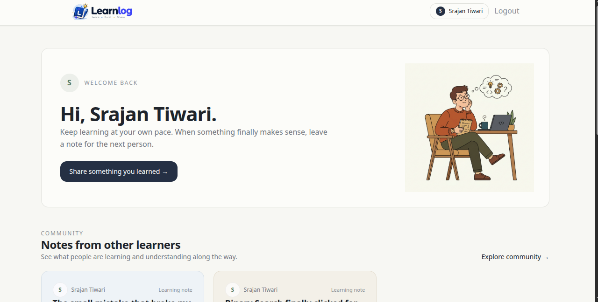
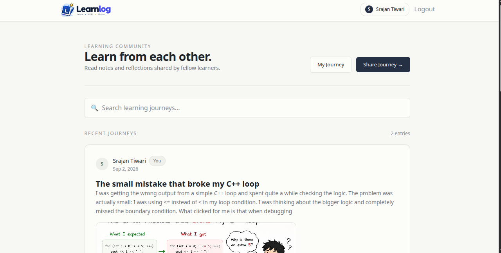
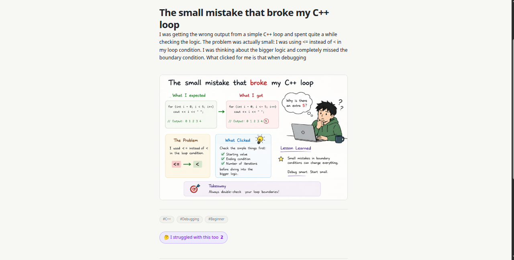

# Learnlog

Learnlog is a simple student learning community where students can share what they learned, what confused them, and what finally clicked.

## Frontend

The frontend is built with:

- React
- JavaScript
- React Router
- Axios
- Tailwind CSS

## UI

### Dashboard

### Community

### Post Details

### Profile

## Features

- Student dashboard
- Learning community
- Create and edit learning posts
- Post reactions
- Comments
- Search
- Pagination
- User profile
- Responsive UI

## Project

Learnlog was built as a learning project to practice frontend and full-stack development.
